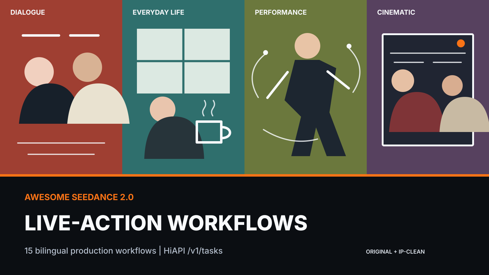

<!-- 本文件由 data/workflows.json 生成。请勿直接编辑。 -->

<div align="center">

<a href="https://www.hiapi.ai/zh?utm_source=github&utm_medium=readme&utm_campaign=awesome-seedance-2-0-live-action-workflows"></a>

# Awesome Seedance 2.0 真人实拍工作流

面向 AI 影视创作者和短视频团队的双语工作流库：电影镜头、生活场景、人物表演、对话视频与 UGC / 纪实。

[HiAPI](https://www.hiapi.ai/zh?utm_source=github&utm_medium=readme&utm_campaign=awesome-seedance-2-0-live-action-workflows) | [Get API Key](https://www.hiapi.ai/zh/register?utm_source=github&utm_medium=readme&utm_campaign=awesome-seedance-2-0-live-action-workflows) | [Seedance 2.0](https://www.hiapi.ai/zh/models/seedance-2-0?utm_source=github&utm_medium=readme&utm_campaign=awesome-seedance-2-0-live-action-workflows) | [Docs](https://docs.hiapi.ai/?utm_source=github&utm_medium=readme&utm_campaign=awesome-seedance-2-0-live-action-workflows) | [Agent Skill](https://github.com/HiAPIAI/hiapi-seedance-2-0-video-skill)

[English](README.md) | **简体中文**

**15 条工作流 | 5 个类别 | T2V / I2V / R2V | HiAPI `/v1/tasks`**

</div>

> **状态说明：** 首发条目是可复用工作流模板，不冒充实测成片。真实 Seedance 2.0 成片案例请查看 [HiAPIAI 提示词画廊](https://github.com/HiAPIAI/awesome-seedance-2-0-prompts)。后续只在获得授权并完成生成验证后添加预览。

本仓库综合参考了热门 Seedance、AI 短片与 Awesome List 项目的入口设计、素材角色、时间轴、质量门槛和贡献机制，同时保持内容原创且聚焦真人场景。详见 [同类开源仓库调研](docs/research-notes.md)。

## 60 秒开始

1. 从下方类别中选择一条工作流。
2. 先离线预览一个无需参考素材的请求：

```bash
npm run generate -- night-corridor-suspense --dry-run
```

3. 设置 `HIAPI_API_KEY` 后去掉 `--dry-run`，即可创建任务并等待结果。
4. 图生视频或参考视频工作流可用重复的 `--media key=url` 替换素材占位符。

需要 Agent 直接执行时，安装 [HiAPI Seedance 2.0 Video Skill](https://github.com/HiAPIAI/hiapi-seedance-2-0-video-skill)。

---

## 按类别浏览

| 类别 | 数量 | 适用场景 |
| --- | ---: | --- |
| [电影镜头](#cinematic-shots) | 3 | 围绕有动机的镜头、真实光源和一个可见戏剧转折设计的写实电影镜头。 |
| [生活场景](#everyday-life) | 3 | 包含自然动作、生活质感和环境声的日常活动与公共空间片段。 |
| [对话场景](#dialogue-scenes) | 3 | 保护视线、克制表演、台词时长和反应镜头的双人短场景。 |
| [人物表演](#performance) | 3 | 由身体节奏和微表情承担叙事的人物、音乐与动作表演工作流。 |
| [纪实与 UGC](#documentary-ugc) | 3 | 强调被记录感而非摆拍感的创作者视频与观察式纪实片段。 |

---

## 每条工作流包含什么

- **镜头意图**：先说明这一段戏在叙事上要完成什么。
- **参考素材角色**：明确人物、场景、动作、声音分别由哪个素材负责。
- **时间轴节拍**：短时长内只保留能被模型稳定完成的动作。
- **连续性锁定**：固定人物身份、服装、道具、光向和空间关系。
- **失败修复**：一次只改一个变量，避免整段提示词推倒重来。
- **HiAPI 请求**：统一使用 `seedance-2.0` 与异步 `/v1/tasks`。

---

<a id="cinematic-shots"></a>

## 电影镜头

围绕有动机的镜头、真实光源和一个可见戏剧转折设计的写实电影镜头。

| 工作流 | 模式 | 时长 | 画幅 | 难度 | 结果 |
| --- | --- | ---: | --- | --- | --- |
| [雨窗重逢](workflows/rain-window-reunion.md) | image-to-video | 10s | 16:9 | intermediate | 用一次对视、一步靠近和雨窗反射完成克制的重逢。 |
| [夜间走廊悬念](workflows/night-corridor-suspense.md) | text-to-video | 8s | 16:9 | starter | 由人物身后实景灯逐盏熄灭推动的单人悬念镜头。 |
| [公寓归来一镜到底](workflows/one-take-apartment-arrival.md) | image-to-video | 15s | 16:9 | advanced | 15 秒连续镜头，从走廊的孤立感进入有人等待的暖色房间。 |

---

<a id="everyday-life"></a>

## 生活场景

包含自然动作、生活质感和环境声的日常活动与公共空间片段。

| 工作流 | 模式 | 时长 | 画幅 | 难度 | 结果 |
| --- | --- | ---: | --- | --- | --- |
| [清晨厨房日常](workflows/morning-kitchen-routine.md) | image-to-video | 10s | 9:16 | starter | 由三个连续小动作构成的竖屏生活片，而不是无关联动作拼贴。 |
| [下班电梯](workflows/after-work-elevator.md) | text-to-video | 8s | 9:16 | starter | 电梯门关闭后才卸下公共场合克制的竖屏微故事。 |
| [夜市漫步](workflows/night-market-walk.md) | reference-to-video | 12s | 9:16 | intermediate | 优先保证人群真实、感官细节和主体稳定的参考驱动竖屏漫步。 |

---

<a id="dialogue-scenes"></a>

## 对话场景

保护视线、克制表演、台词时长和反应镜头的双人短场景。

| 工作流 | 模式 | 时长 | 画幅 | 难度 | 结果 |
| --- | --- | ---: | --- | --- | --- |
| [咖啡馆未说出口的道歉](workflows/cafe-unspoken-apology.md) | image-to-video | 12s | 16:9 | intermediate | 道歉通过一句没说完的话和倾听者反应落地的双人对话场景。 |
| [办公室辞职反转](workflows/office-resignation.md) | image-to-video | 12s | 9:16 | advanced | 前两秒钩子加未解答结尾揭示的竖屏双人微短剧。 |
| [门口和解](workflows/doorstep-reconciliation.md) | image-to-video | 15s | 16:9 | intermediate | 以允许进门而非彻底和解结束的双人门口场景。 |

---

<a id="performance"></a>

## 人物表演

由身体节奏和微表情承担叙事的人物、音乐与动作表演工作流。

| 工作流 | 模式 | 时长 | 画幅 | 难度 | 结果 |
| --- | --- | ---: | --- | --- | --- |
| [克制镜头独白](workflows/restrained-camera-monologue.md) | image-to-video | 12s | 16:9 | intermediate | 声音节奏、呼吸和视线比手势更重要的单人近景表演。 |
| [街舞排练](workflows/street-dance-rehearsal.md) | reference-to-video | 10s | 9:16 | advanced | 迁移动作节奏和走位但不迁移源舞者身份的动作参考工作流。 |
| [房间原声演奏](workflows/acoustic-room-performance.md) | reference-to-video | 15s | 16:9 | advanced | 保持手、乐器、人声和房间声学一致的单镜头音乐人工作流。 |

---

<a id="documentary-ugc"></a>

## 纪实与 UGC

强调被记录感而非摆拍感的创作者视频与观察式纪实片段。

| 工作流 | 模式 | 时长 | 画幅 | 难度 | 结果 |
| --- | --- | ---: | --- | --- | --- |
| [街头采访回答](workflows/street-interview-answer.md) | text-to-video | 10s | 9:16 | starter | 带真实停顿、一句简洁回答和环境干扰的竖屏创作者采访。 |
| [厨房产品体验口播](workflows/kitchen-product-testimonial.md) | image-to-video | 10s | 9:16 | starter | 产品自然被使用、表达具体且不过度包装的低精修 UGC 口播。 |
| [手工作坊一日片段](workflows/workshop-day-in-life.md) | text-to-video | 15s | 16:9 | intermediate | 从手部、人物到完成物自然推进，不使用光鲜商业补拍的观察式微序列。 |

---

## 参与贡献

欢迎提交原创、去 IP、可复用的真人写实工作流。请阅读 [CONTRIBUTING.md](CONTRIBUTING.md)，并运行 `npm test`。

## 许可

[CC BY 4.0](LICENSE). 原创资产与外部参考边界见 [NOTICE.md](NOTICE.md)。
